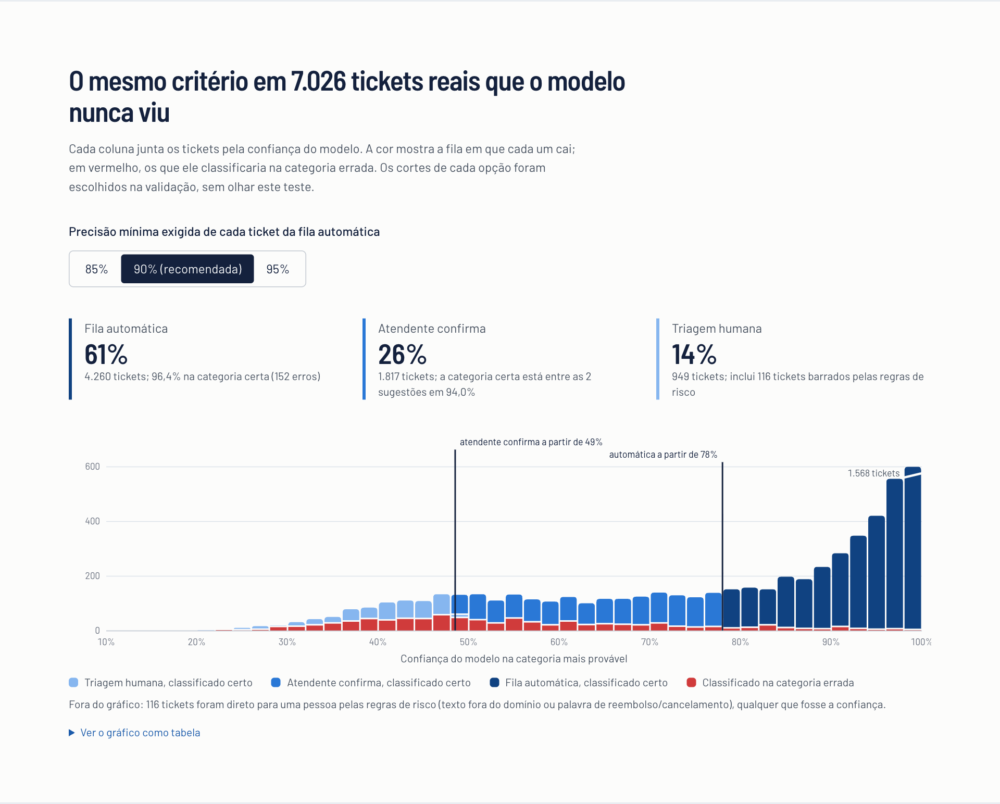
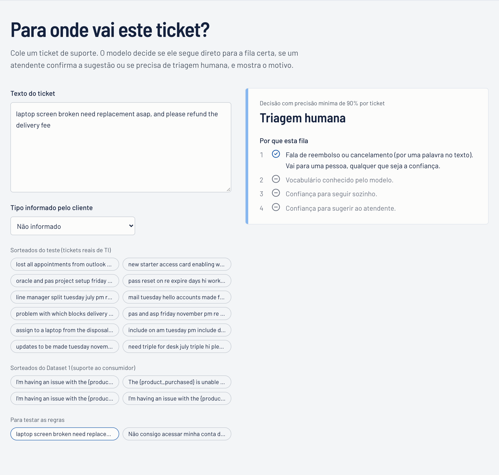

# Submissão — Fabio Souza — Challenge 002

## Sobre mim

- **Nome:** Fabio Souza
- **LinkedIn:** {{LINKEDIN}}
- **Challenge escolhido:** 002 — Redesign de Suporte

---

## Executive Summary

**Os dados operacionais não permitem dizer onde o suporte perde tempo nem o que derruba a satisfação.** O Dataset 1 não registra a abertura do ticket; em 49% dos fechados a resolução vem antes da primeira resposta; e nenhuma das 9 variáveis testadas explica a nota, com poder estatístico para detectar efeitos pequenos.

**A automação, por outro lado, tem evidência real.** Um classificador treinado em 32.889 tickets reais de TI (Dataset 2) foi testado em 7.026 que nunca viu, separados por grupos de quase-duplicados:

- **61%** vão direto para a fila certa, com **96% de acerto**;
- **26%** vão para o atendente confirmar entre 2 sugestões;
- **12%** seguem para triagem humana;
- **reembolso e cancelamento vão sempre para uma pessoa.**

Um protótipo roda essa política no navegador. Na base do brief, a triagem devolve **34,7 h/mês** (R$ 1,2 mil), numa faixa de 5 a 170 h que depende sobretudo do tempo de triagem manual, mensurável em uma semana.

**Recomendação principal:** registrar cinco eventos por ticket e rodar um piloto de 6 semanas em modo sombra, com o modelo treinado nos tickets da própria operação. O modelo atual não transfere para suporte ao consumidor.

---

## Solução

| Entregável | Onde |
|---|---|
| Diagnóstico operacional | [`docs/diagnostico.md`](docs/diagnostico.md) |
| Proposta de automação: fluxo, o que não automatizar, piloto | [`docs/proposta-de-automacao.md`](docs/proposta-de-automacao.md) |
| Ficha do modelo | [`docs/modelo.md`](docs/modelo.md) |
| Protótipo (Next.js, roda no navegador) | [`solution/app`](solution/app) |
| Análise reproduzível (Python, 7 scripts, testes) | [`solution/analysis`](solution/analysis) |

**Como rodar tudo do zero** (~3 min; requer [uv](https://docs.astral.sh/uv/) ou Python 3.12, Node 20+ e pnpm):

```bash
cd submissions/fabio-souza/solution
bash run_all.sh        # baixa os dados (sem credencial), roda a análise, 268 testes e o build
cd app && pnpm dev     # http://localhost:3000
```

Só o protótipo, sem Python: `cd solution/app && pnpm install && pnpm dev`. Os dados do modelo já estão exportados.

A reprodução foi verificada num clone limpo do branch. Todas as saídas saíram idênticas byte a byte, exceto o ECE do SVM calibrado, que diverge na 9ª casa decimal por ruído numérico.

### Abordagem

1. **Entender como o desafio é avaliado.** A IA leu as regras e as ~200 reviews públicas do avaliador nos PRs de outros candidatos, para saber o que reprova: log de processo não auditável, higiene de repositório, entrega que não reproduz. Nenhum código ou texto de outro candidato foi usado; os problemas de dados citados nessas reviews foram tratados como alegações a verificar.
2. **Decidir os limites antes de olhar os dados.** O Fabio definiu que reembolso e cancelamento nunca são automatizados. As hipóteses e as regras de decisão foram pré-registradas por escrito antes da análise ([`process-log/hipoteses-pre-registradas.md`](process-log/hipoteses-pre-registradas.md)).
3. **Auditar os dois datasets antes de calcular qualquer indicador.** Testes corrigidos para múltiplas comparações, tamanho de efeito e poder estatístico.
4. **Escolher o modelo pela métrica que vira hora economizada**: a cobertura da fila automática com acerto ≥ 90% por ticket, e não a acurácia. A divisão treino/teste é por grupos de quase-duplicados, para não inflar o resultado.
5. **Testar o que acontece fora do domínio de treino**, aplicando o modelo ao texto do Dataset 1.
6. **Calcular o ROI como fórmula**, com a origem de cada insumo: medido, premissa, brief ou decisão do Fabio.
7. **Construir o protótipo com paridade testada contra o Python.** Levar as decisões de negócio ao Fabio com os números na mão, e devolver a ele, no fim, as decisões de operação que ainda estavam com a IA (checkpoints 2 e 3).

### Resultados / Findings

| Pergunta | Achado | Evidência |
|---|---|---|
| Onde o fluxo trava? | **Não calculável.** Não há data de abertura; todas as respostas e resoluções cabem em 27 horas; nenhum canal, prioridade ou tipo difere dos outros | [`diagnostico.md` §1](docs/diagnostico.md) |
| O que impacta a satisfação? | **Nada no dado atual.** 9 testes, zero efeitos após Holm; o único p < 0,05 some com a correção | [`diagnostico.md` §2](docs/diagnostico.md) |
| Quanto desperdiçamos? | **Função, não número.** 34,7 h/mês na base do brief (5,3 a 169,6 h). A maior incerteza é o tempo de triagem manual | [`06_roi.json`](solution/analysis/outputs/06_roi.json) |
| O que automatizar? | Triagem em 3 filas: **61,4% automáticos com 96,4% de acerto** (IC 95%: 95,8–96,9%), 26,4% assistidos (certa entre 2 sugestões em 94%), 12,2% humanos | [`modelo.md`](docs/modelo.md) |
| E fora da IA? | **Formulário para pedidos de compra**: 976 tickets idênticos, 40% da categoria. **Resposta sugerida por ticket gêmeo**: 12,3% têm um quase idêntico | [`02_auditoria_ds2.json`](solution/analysis/outputs/02_auditoria_ds2.json) |
| O modelo serve para suporte ao consumidor? | **Não.** Manda 88% para Hardware, e 28,6% passariam como "confiantes". Travas simples barram no máximo 41% | [`04_transferencia_ds1.json`](solution/analysis/outputs/04_transferencia_ds1.json) |
| Quantos dados próprios são necessários? | 1 mil tickets rotulados dão 25% de fila automática; 5 mil dão 40%; 33 mil dão 61% | [`05_curva_de_aprendizado.json`](solution/analysis/outputs/05_curva_de_aprendizado.json) |





### Recomendações

1. **Semana 0: registrar cinco eventos por ticket** (abertura, mudanças de fila, interações, resolução, satisfação ligada ao ticket). Sem isso, "onde perdemos tempo" continua sem resposta.
2. **Criar o formulário estruturado para pedidos de compra.** É a automação de maior retorno por esforço, e não usa IA.
3. **Pilotar a triagem em três filas por 6 semanas.** Duas em modo sombra com tickets rotulados da própria operação (meta: 5 mil), depois fila automática com critérios explícitos de continuar ou voltar ([`proposta-de-automacao.md`](docs/proposta-de-automacao.md)).
4. **Sugerir ao atendente a resposta do ticket gêmeo.** Nunca fechar como duplicado sem uma pessoa.
5. **Manter com pessoas:** reembolso e cancelamento; concessão de acesso e RH, que a IA pode rotear mas nunca executar; tickets de baixa confiança; texto fora do domínio.

### Limitações

- **Dataset 1:** é sintético (distribuições uniformes, e-mails `example.com`, templates com placeholder), então nenhuma conclusão sobre uma operação real sai dele.
- **Modelo:** treinado em tickets de TI interna, não transfere para suporte ao consumidor. A trava de domínio é parcial (barra 41%).
- **Tempos e custos:** são premissas explícitas; o ROI é uma fórmula para a operação preencher.
- **Corte da fila automática:** levemente otimista. O acerto no corte foi 90,5% na validação e ~88% no teste; por isso o piloto recalibra e monitora a taxa de correção.
- **Regra por palavra-chave:** tem falsos positivos ("cancel meeting" em TI, 0,7% dos tickets). O custo foi aceito explicitamente (D14), para não depender do cliente acertar o campo de tipo.
- **Protótipo:** demonstra a política de filas, sem integração com help desk, login ou geração de respostas por IA.

---

## Process Log — Como usei IA

> Detalhes em [`process-log/`](process-log): diário com horários, decisões com as respostas literais dos checkpoints, erros da IA, hipóteses pré-registradas e capturas de tela.

### Ferramentas usadas

| Ferramenta | Para que usou |
|------------|--------------|
| Claude Code (Claude Opus 5) | Agente principal: leitura das regras e das reviews públicas, análise estatística, modelo, protótipo, testes e documentação |
| Revisor-IA (segundo modelo, ferramenta *advisor* do Claude Code) | Auditoria do raciocínio antes de cada etapa grande. Pegou o erro de denominador na escolha do desafio (E1) e o erro contado duas vezes no ROI (E10) |
| GitHub CLI e API | Coleta dos 124 PRs e das reviews do avaliador |
| Playwright com Chrome | Capturas do protótipo e verificação visual em celular e modo escuro; achou a página com 6.942 px de largura (E11) |
| Validador de paleta (skill de visualização) | Cores dos gráficos acessíveis a daltônicos e com contraste adequado |

### Workflow

1. **15:30** — Escolha do desafio: leitura das regras e das reviews públicas; estatística de aprovação por desafio.
2. **16:01–16:06** — Checkpoint 1: o Fabio define a política de risco; hipóteses delegadas e pré-registradas.
3. **16:10–16:52** — Auditorias, classificador, mudança de domínio, curva de aprendizado e ROI, em 9 commits.
4. **16:36–16:41** — Checkpoint 2: decisões de negócio do Fabio (precisão, regra, acesso/RH, custo/hora).
5. **17:00–19:15** — Protótipo, paridade Python ↔ TypeScript, verificação visual, reprodução num clone limpo e documentação.
6. **19:30–19:50** — Conferência final: cada número dos documentos conferido contra o JSON que ele cita (dois não batiam, E15).
7. **19:54** — Checkpoint 3: a IA devolveu as decisões de operação que ainda estavam com ela; o Fabio decidiu três (critério do piloto, falsos positivos da regra de risco, ordem de execução) e delegou uma de volta.

### Onde a IA errou e como corrigi

Quinze erros reais, todos documentados com evidência em [`process-log/erros-da-ia.md`](process-log/erros-da-ia.md). Os mais relevantes:

- **E7 — a regra que a própria IA pré-registrou era falha.** "Precisão média ≥ 90%" aceitava tickets que acertam 0–52%, escondidos na média. Foi trocada por uma regra por ticket; o desvio está documentado e as duas regras aparecem nos resultados.
- **E9 — número inflado.** A trava de domínio foi reportada barrando 95% do texto estranho, inclusive numa mensagem de commit. O certo era 41%; a correção está num commit explícito.
- **E10 — ROI com erro contado duas vezes.** O ponto de empate real é 75%, não 80%.
- **E3/E4 — testes estatísticos mal aplicados.** KS em variável discreta e V de Cramér enviesado teriam gerado falsos achados.
- **E11 — protótipo quebrado no celular.** A página tinha 6.942 px de largura; foi pego pela verificação visual antes do commit.
- **E15 — número escrito à mão que não batia com o JSON.** Este README dizia "treinado em 47.837 tickets" e "testado em 7.026 que nunca viu", sendo que os 7.026 fazem parte dos 47.837. Pego na conferência final de cada número contra a sua fonte.

### O que eu adicionei que a IA sozinha não faria

Nada de código. O que eu fiz foi decidir onde a IA não manda, e a que horas — está em [`decisoes.md`](process-log/decisoes.md), com quem decidiu marcado linha a linha.

**Os limites vieram antes dos dados.** Às 16:06, antes de a IA abrir qualquer CSV, respondi que reembolso e cancelamento nunca são resolvidos sem uma pessoa. Por isso essa regra roda **antes** do classificador no fluxo, e não como exceção acrescentada depois. Decidida na ordem inversa, ela teria saído da capacidade do modelo, e não do risco do negócio — e a diferença aparece na regra por palavra-chave: ela manda 0,7% dos tickets de TI para humano à toa, e eu aceitei esse custo em vez de confiar só no campo de tipo, que o cliente preenche errado.

**Deleguei de propósito o que eu não tinha base para decidir.** Perguntado onde a operação perde tempo, respondi *"Descubra!"*. Sobre a precisão mínima da fila automática, *"Decida por mim"*. Um palpite meu ali viraria a hipótese que a análise tentaria confirmar. Em compensação, nada foi decidido no meio do caminho: as hipóteses estão pré-registradas em commit anterior aos resultados que elas governam, e quando a IA descobriu que a regra que ela mesma tinha pré-registrado era falha (E7), o desvio veio para mim aprovar, em vez de ser corrigido em silêncio.

**Com os números na mão, escolhi o lado conservador três vezes.** R$ 35/h em vez de R$ 50/h, sem recomendação da IA para nenhum dos dois: com o valor maior, a economia anunciada subiria 43% sem um minuto a mais de ganho real. Em acesso e RH, a IA só roteia; conceder continua com uma pessoa. E no piloto, fiquei com o critério mais exigente do que o próprio resultado do teste (manter só com acerto ≥ 95%, contra 96,4% medidos), porque desligar cedo custa menos do que descobrir tarde.

**A ordem de execução é minha, e ela contraria o pedido do brief.** O brief pede automação com IA; a primeira coisa da minha lista é um formulário que não usa IA, e logo atrás vem instrumentar o que hoje não se mede. A triagem, que é o pedido literal, é a terceira — porque 976 pedidos de compra idênticos são ganho garantido e sem risco, enquanto a triagem depende de um modelo treinado em dados que essa operação ainda não tem.

**O que a IA decidiu está escrito que foi a IA.** O modelo, os cortes de confiança, o múltiplo do custo do erro e as hipóteses são dela, marcados como tal em `decisoes.md`. Em três das quatro perguntas do checkpoint 2, eu segui a recomendação dela. Prefiro entregar isso a uma lista de decisões que eu não saberia defender numa conversa.

---

## Evidências

- [ ] Screenshots das conversas com IA
- [ ] Screen recording do workflow
- [ ] Chat exports — optei por não publicar a transcrição bruta da sessão. O que ela provaria está reconstruído de forma verificável: as perguntas e respostas dos dois checkpoints estão transcritas literalmente em [`decisoes.md`](process-log/decisoes.md), com horário, e a ordem dos acontecimentos é conferível no `git log`
- [x] Git history: commits incrementais, cada mensagem dizendo o que mudou e o que corrigiu. As hipóteses e o critério do modelo estão em commits **anteriores** aos resultados que governam
- [x] Outro: 9 capturas do protótipo rodando em [`process-log/screenshots`](process-log/screenshots), hipóteses pré-registradas, decisões com as respostas literais do Fabio, 268 testes automatizados (10 Python + 258 TypeScript) e `run_all.sh`, que refaz tudo do zero

---

_Submissão enviada em: 15/09/2026_
